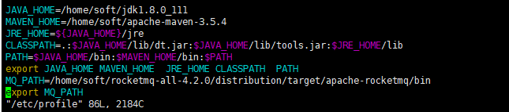
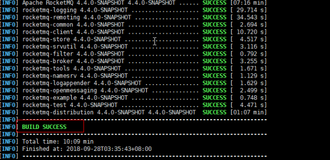
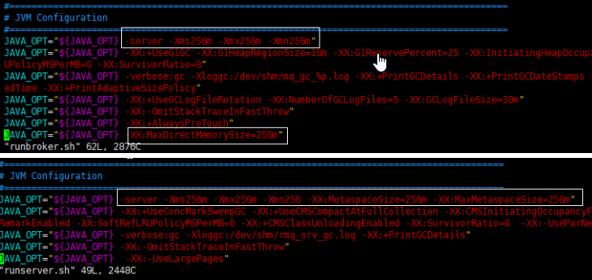
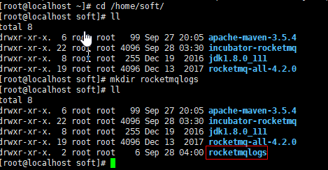
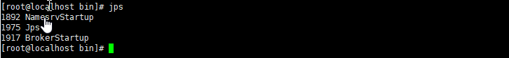
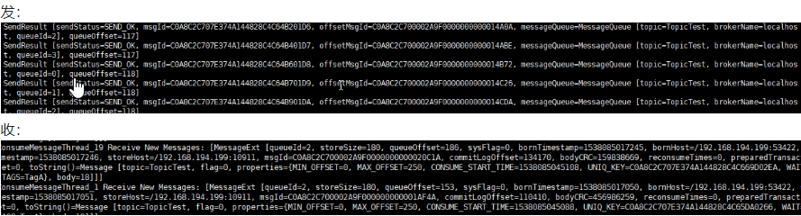
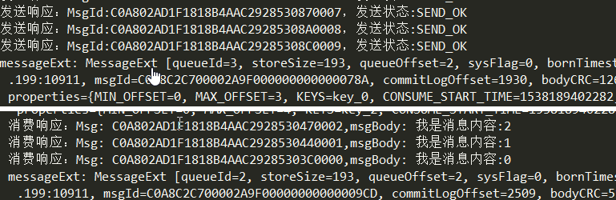
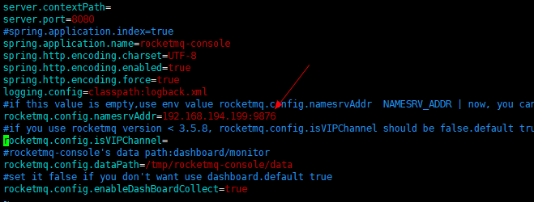
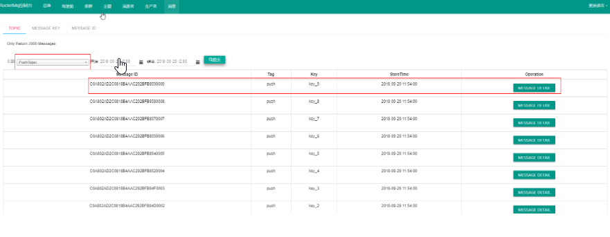

# 在这里主要讲述rocketmq单机版安装，亲自采坑，实测有效
## 必要前提：要练此功，先看这个
* 将你的虚拟机设置成静态ip并可以上网,后面需要安装监控台和远程连接
* 始终记得要关闭防火墙


## 下载JDK1.8和maven3.5,配置环境变量
```
>vim /etc/profile #修改环境变量配置
>. /etc/profile   #使环境变量生效

```



## 下载编译rocketmq
* 下载rocketmq-all-4.2.0-source-release版(https://www.apache.org/dyn/closer.cgi?path=rocketmq/4.2.0/rocketmq-all-4.2.0-source-release.zip)
```
>unzip rocketmq-all-4.2.0-source-release.zip
>cd rocketmq-all-4.2.0
>mvn -Prelease-all -DskipTests clean install -U
```


## 修改JVM参数

修改runbroker.sh和runserver.sh

```

>cd /home/soft/rocketmq-all-4.2.0/distribution/target/apache-rocketmq/bin
>vim runbroker.sh
>vim runserver.sh

```



## 建立日志目录



## 在bin目录下面配置broker启动模版

```
>cd /home/soft/rocketmq-all-4.2.0/distribution/target/apache-rocketmq/bin
>vim broker.p

```
示例

```
namesrvAddr=127.0.0.1:9876
brokerIP1=192.168.194.199 #这个是虚拟机的ip，你需要将虚拟机设置成静态ip
brokerName=localhost
brokerClusterName=DefaultCluster
brokerId=0
autoCreateTopicEnable=true
autoCreateSubscriptionGroup=true
rejectTransactionMessage=false
fetchNamesrvAddrByAddressServer=false
storePathRootDir=/root/store
storePathCommitLog=/root/store/commitlog
flushIntervalCommitLog=1000
commitIntervalCommitLog=1000
flushCommitLogTimed=false
deleteWhen=04
fileReservedTime=72
maxTransferBytesOnMessageInMemory=262144
maxTransferCountOnMessageInMemory=32
maxTransferBytesOnMessageInDisk=65536
maxTransferCountOnMessageInDisk=8
accessMessageInMemoryMaxRatio=40
messageIndexEnable=true
messageIndexSafe=false
haMasterAddress=
brokerRole=ASYNC_MASTER
flushDiskType=ASYNC_FLUSH
cleanFileForciblyEnable=true
transientStorePoolEnable=false

```

## 启动mq

>分别启动nameserver和broker

```
>cd /home/soft/rocketmq-all-4.2.0/distribution/target/apache-rocketmq/bin
> nohup sh mqnamesrv >>/home/soft/rocketmqlogs/mqnamesrv.log 2>&1 &
>nohup sh mqbroker -n 192.168.194.199:9876 -c broker.p autoCreateTopicEnable=true >>/home/soft/rocketmqlogs/broker.log 

```
>使用jps命令查看状态



> 来一波测试

* 测试消息收发，进入bin目录 -- 在发送/接收消息之前，我们需要告诉客户名称服务器的位置。RocketMQ 提供了多种方法来实现这一点。为了简单起见，我们 `` 暂时 `` 使用环境变量NAMESRV_ADDR

```
>export NAMESRV_ADDR=localhost:9876
>sh tools.sh org.apache.rocketmq.example.quickstart.Producer #发
>sh tools.sh org.apache.rocketmq.example.quickstart.Consumer #收

```



## 集成springboot

> 导入依赖

```
!-- RocketMq客户端相关依赖 -->
        <dependency>
            <groupId>org.apache.rocketmq</groupId>
            <artifactId>rocketmq-client</artifactId>
            <version>4.1.0-incubating</version>
        </dependency>

        <dependency>
            <groupId>org.apache.rocketmq</groupId>
            <artifactId>rocketmq-common</artifactId>
            <version>4.1.0-incubating</version>
        </dependency>
        
```

> 配置namserver和组

```

# 消费者的组名
apache.rocketmq.consumer.PushConsumer=PushConsumer

# 生产者的组名
apache.rocketmq.producer.producerGroup=Producer

# NameServer地址
apache.rocketmq.namesrvAddr=192.168.194.199:9876

```

> 生产者、消费者

生产者

```
@Component
public class Producer {

    /**
     * 生产者的组名
     */
    @Value("${apache.rocketmq.producer.producerGroup}")
    private String producerGroup;

    /**
     * NameServer 地址
     */
    @Value("${apache.rocketmq.namesrvAddr}")
    private String namesrvAddr;

    @PostConstruct
    public void defaultMQProducer() {

        //生产者的组名
        DefaultMQProducer producer = new DefaultMQProducer(producerGroup);

        //指定NameServer地址，多个地址以 ; 隔开
        producer.setNamesrvAddr(namesrvAddr);

        try {

            /**
             * Producer对象在使用之前必须要调用start初始化，初始化一次即可
             * 注意：切记不可以在每次发送消息时，都调用start方法
             */
            producer.start();

            for (int i = 0; i < 100; i++) {

                String messageBody = "我是消息内容:" + i;

                String message = new String(messageBody.getBytes(), "utf-8");

                //构建消息
                Message msg = new Message("PushTopic" /* PushTopic */, "push"/* Tag  */, "key_" + i /* Keys */, message.getBytes());

                //发送消息
                SendResult result = producer.send(msg);

                System.out.println("发送响应：MsgId:" + result.getMsgId() + "，发送状态:" + result.getSendStatus());

            }

        } catch (Exception e) {
            e.printStackTrace();
        } finally {
            producer.shutdown();
        }

    }
}
```

消费者

```
@Component
public class Consumer {

    /**
     * 消费者的组名
     */
    @Value("${apache.rocketmq.consumer.PushConsumer}")
    private String consumerGroup;

    /**
     * NameServer地址
     */
    @Value("${apache.rocketmq.namesrvAddr}")
    private String namesrvAddr;

    @PostConstruct
    public void defaultMQPushConsumer() {

        //消费者的组名
        DefaultMQPushConsumer consumer = new DefaultMQPushConsumer(consumerGroup);

        //指定NameServer地址，多个地址以 ; 隔开
        consumer.setNamesrvAddr(namesrvAddr);
        try {
            //订阅PushTopic下Tag为push的消息
            consumer.subscribe("PushTopic", "push");

            //设置Consumer第一次启动是从队列头部开始消费还是队列尾部开始消费
            //如果非第一次启动，那么按照上次消费的位置继续消费
            consumer.setConsumeFromWhere(ConsumeFromWhere.CONSUME_FROM_FIRST_OFFSET);
            consumer.registerMessageListener(new MessageListenerConcurrently() {

                @Override
                public ConsumeConcurrentlyStatus consumeMessage(List<MessageExt> list, ConsumeConcurrentlyContext context) {
                    try {
                        for (MessageExt messageExt : list) {

                            System.out.println("messageExt: " + messageExt);//输出消息内容

                            String messageBody = new String(messageExt.getBody(), "utf-8");

                            System.out.println("消费响应：Msg: " + messageExt.getMsgId() + ",msgBody: " + messageBody);//输出消息内容

                        }
                    } catch (Exception e) {
                        e.printStackTrace();
                        return ConsumeConcurrentlyStatus.RECONSUME_LATER; //稍后再试
                    }
                    return ConsumeConcurrentlyStatus.CONSUME_SUCCESS; //消费成功
                }


            });
            consumer.start();
        } catch (Exception e) {
            e.printStackTrace();
        }
    }

```

> 启动



## 安装控制台

>下载编译

```
>git clone https://github.com/apache/rocketmq-externals 

```

> 修改配置

```
>cd /home/soft/rocketmq-externals/rocketmq-console
>vim src/main/resources/appplication.properties 
```



> 编译

```
>cd rocketmq-externals/rocketmq-console/
>mvn clean package -Dmaven.test.skip=true
```

>启动

```
>cd rocketmq-externals-master/rocketmq-console/target
>nohup java -jar rocketmq-console-ng-1.0.0.jar >>/home/soft/rocketmqlogs/consolelog.log 2>&1 &
```
> 打开查看
* http://192.168.194.199:8080



>关闭

```
>cd /home/soft/rocketmq-all-4.2.0/distribution/target/apache-rocketmq/bin
>sh mqshutdown broker
>sh mqshutdown namesrv
```
