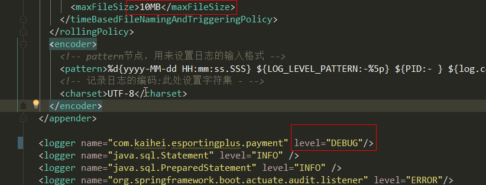
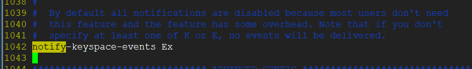
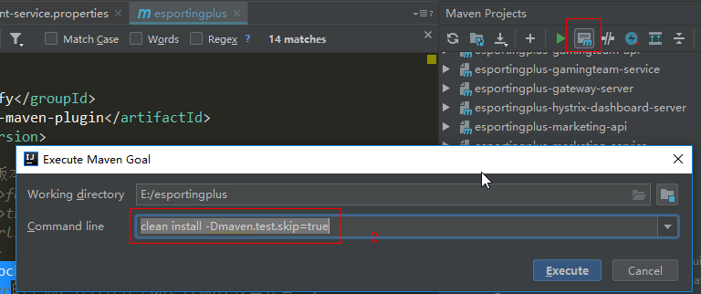
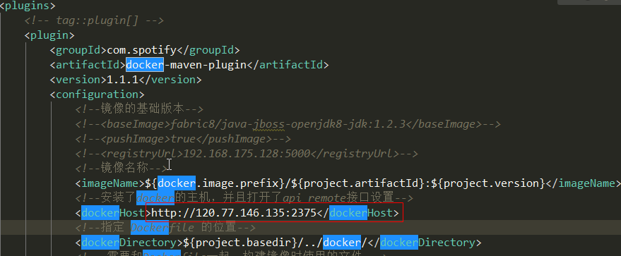
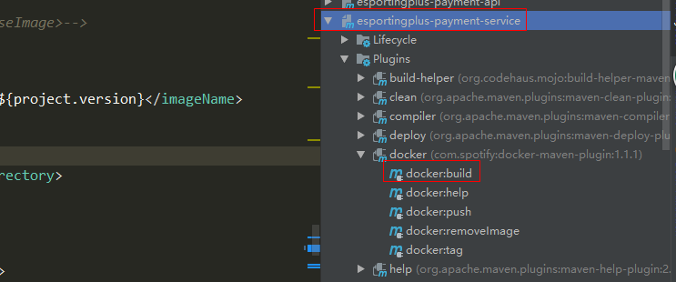
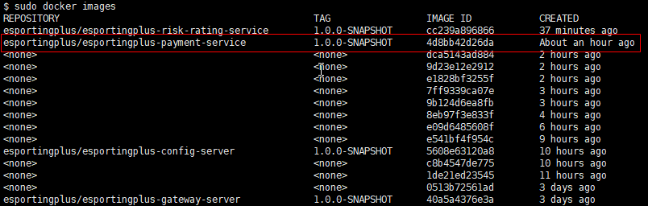
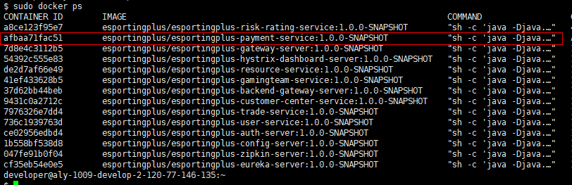
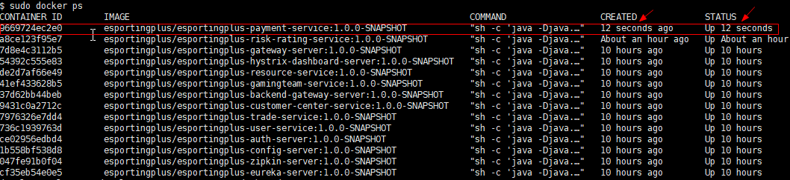

# 工程打包
## 修改你的服务对应的配置文件

>logback.xml,日志相关。例如修改日志的级别和保存期限



>bootstrap.yml，启动本服务的相关的配置

* 注意，如果配置中心有相同配置会覆盖此文件的同名配置，因为bootstrap.yml是最先加载的（先加载的最快，但会被覆盖）
* 这里主要保存的是注册服务名/消息队列的group等频繁修改调整的东西，配置中心主要配置项目开发/测试的数据库等不变的配置

## 修改redis相关配置(如果已经修改可以略过此说明)
因为我们项目中会对超时的key进行监听，所以我们需要在redis.conf中进行该项配置，
具体如下：notify-keyspace-events Ex，默认是被注释了的。




## 设置maven打包命令，运行打包

## 构建docker镜像
>修改父工程maven pom文件的docker插件配置



>构建镜像



# 服务部署
## 登录开发服务器地址:120.77.146.135
## 查看镜像是否构建成功
```
docker images
```


## 查看所有运行的容器
```
cd /home/developer/docker/dev
sudo docker ps
sudo docker ps -a #这个是查看所有的容器，包括停止的容器
```


## 现在我们需要停止自己服务的容器
* 很多人会问---为啥需要停止容器?因为容器是根据镜像运行而来的，而你的新的镜像在运行之前，你的服务容器还是上次的镜像运行生成的。你可以这样理解:镜像是java类，容器是class文件，你更改了java代码，服务上次的class文件你得清除啊，不然你找事呢。

### 停止并删除指定容器
```
docker stop containerId #按照容器id
docker  rm  containerId
docker container rm dev_paymentservice_1 #按照容器名删除
```
### 构建新docker容器
```
cd /home/developer/docker/dev
docker-compose -f docker-compose.yml up -d
```
### 查看自己构建的新容器


# 注意事项
* docker-compose会使用已构建好的镜像构建容器，如果你已经重新编译镜像，请务必你删除之前的镜像（当然你也可以修改docker-compse.yml,将'image'改成'build',指定构建的dockerfile即可）

>停止删除所有容器（手残党慎用）

```
docker-compose down #执行该命令需要和docker-compose.yml一个路径
```


>查看容器日志
  
 * 使用命令进入指定容器内部查看日志：docker logs -f container_name  -f
  
 * 如果在docker-compose中的VOLUME中指定了映射，直接可以在宿主机中的映射目录查看即可

